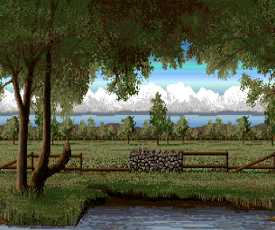
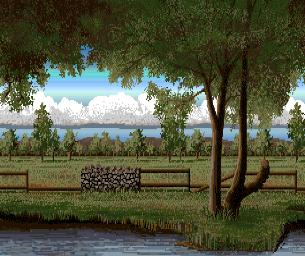

[Amiga 500](https://en.wikipedia.org/wiki/Amiga_500) demo featuring the following technical highlights:
* [Assembly](https://en.wikipedia.org/wiki/Assembly_language) programming on the [Motorola 68000](https://en.wikipedia.org/wiki/Motorola_68000) for calculating 3D-rotation of the globe.
* Heavy use of the [Blitter](https://en.wikipedia.org/wiki/Amiga_Original_Chip_Set#Blitter) to achieve [parallax scrolling](https://en.wikipedia.org/wiki/Parallax_scrolling), also called *2.5D-scrolling*. Note that the clouds move right while the left moves to the left (the further away the slower).
	* Considering the five [bitplanes](https://en.wiktionary.org/wiki/bitplane) and the arbitrariness of the image sizes, the achieved [frame rate](https://en.wikipedia.org/wiki/Frame_rate) of *5+* really stands out.
	* In comparison, [Shadow of the Beast](https://en.wikipedia.org/wiki/Shadow_of_the_Beast_(1989_video_game)) has a *20+* frame rate but relies on the several restrictions regarding the object overlap that is only partially alleviated by the [double playfield](https://en.wikipedia.org/wiki/Amiga_Original_Chip_Set#:~:text=dual%2dplayfield) setup.
* [Color cycling](https://en.wikipedia.org/wiki/Color_cycling) for the river plain during [vertical blank](https://en.wikipedia.org/wiki/Raster_interrupt) by the [Copper](https://en.wikipedia.org/wiki/Amiga_Original_Chip_Set#Copper).
* The sky has a color gradiant obtained by the Copper list during horizontal blanks.




The pixel art looks strangely familiar...  I do not own any of used images. The demo was a purely educational endeavour to have fun while exploring the possibilities of Amiga's [OCS](https://en.wikipedia.org/wiki/Amiga_Original_Chip_Set).

# How to Start
The easiest way is to put the repository into a mounted directory of an *emulated A500* and to invoke the *executable* which is provided for convenience.
```
cd bin
Demo
```

At the start, the precalculation of the animation lasts about two minutes. So you need to be patient.

The sources are also included. Within your *assembly IDE*, you need to assemble `src/Demo` and start it from the `src` folder (relative pathes at work...).

By the way, press the mouse button to stop the demo.

# Some History

I made this demo in order to achieve the same effects as [Shadow of the Beast](https://en.wikipedia.org/wiki/Shadow_of_the_Beast_(1989_video_game)) and the likes before actually understanding the [tricks](https://codetapper.com/amiga/sprite-tricks/shadow-of-the-beast/) applied (and their restrictions).
